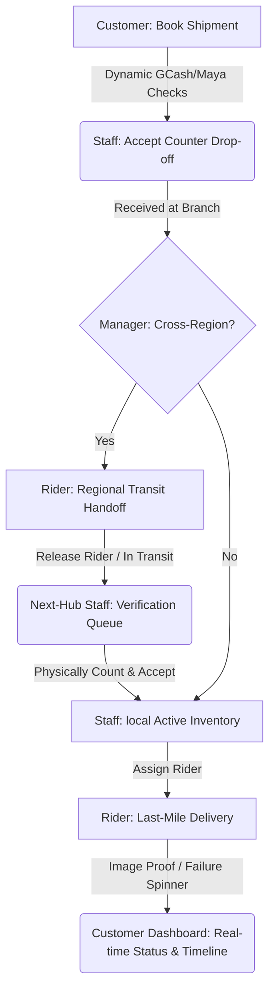

# SPX Express — Native Android Mobile Application 🚚

Welcome to the official repository of **SPX Express Mobile**—a high-fidelity, native Android logistics and courier management application designed to bridge front-line dispatch operators and delivery riders with centralized hub operations.

SPX Express leverages an offline-ready **NoSQL Firebase Realtime Database** as a dynamic communication bridge, synchronizing logistics records instantly across mobile devices and web management consoles.

---

## 🌟 Key Features

### 1. 🎨 Premium Visual Identity & Poppins Typography
- **Google Poppins Fonts**: Natively integrated Poppins typography across all layouts to elevate visual appeal and text hierarchy.
- **Dynamic Welcome Header**: Custom `72dp` welcome toolbars equipped with circular user avatars, contextual greetings, and color-coded role-badge pills reflecting active sessions.
- **Role-Appropriate Brand Tints**: Displays visual layouts styled to match specific roles:
  - 🛠️ **System Administrator**: Slate Gray (`#F1F5F9`)
  - 🟢 **Branch Manager**: Emerald Green (`#ECFDF5`)
  - 🔵 **Staff Operator**: Royal Blue (`#EFF6FF`)
  - 🟡 **Delivery Rider**: Amber/Orange (`#FFF7ED`)
  - 💗 **Customer**: Pink/Magenta (`#FDF2F8`)

### 2. 🗺️ Intelligent Hub-and-Spoke Regional Routing
- **Macro-Region Classification**: Standardized routing engine mapping active physical hubs into **Luzon** (Hub ID 1), **Visayas** (Hub ID 2), and **Mindanao** (Hub ID 3).
- **Multi-Hop Transit**: Automatically detects cross-region bookings and routes the parcel through intermediate regional sorting hubs first before reaching its final destination branch.
- **Last-Mile Delivery**: Automatically routes intra-region bookings directly to the destination hub, saving transit time.

### 3. 📦 Secure Handoff & "Incoming Queue" Workflow
- **Rider Release**: When a rider completes a hub-to-hub transit leg and confirms handoff, the package is released from their active route sheet, keeping its status as `"In Transit"`.
- **Validation Gate**: Parcl does *not* enter the next hub's active stock immediately. It sits safely in the receiving staff's **Incoming Queue** for auditing.
- **Physical Count Acceptance**: Station staff must inspect, count, and physically accept the package to move it into local **Local Active Inventory** for last-mile dispatch.

### 4. 🔒 Enterprise-Grade Security & Authentication
- **Secure Password Enforcements**: Integrated standard **BCrypt** credentials validation, preventing sign-in bypasses.
- **BCrypt Blowfish Compatibility**: Automatically translates PHP Blowfish `$2y$` prefixes to standard JVM-compatible `$2a$` prefixes in real time, supporting cross-login with MySQL web databases.
- **Device-Level Encrypted Sessions**: Session credentials (IDs, Roles, Names) are stored in secure **`EncryptedSharedPreferences`** to prevent data leaks.
- **Roster Safety Gates**: Roster profiles utilize **Stacked Deletion Layouts** (Save Changes $\rightarrow$ red outlined Delete $\rightarrow$ Cancel) along with secure self-deletion blocks to prevent accidental account lockouts.

### 5. 💳 Strict Digital Wallet Validations (GCash & Maya)
- **Real-Time Regex Gating**: Validates reference numbers on booking: exactly 13 digits for GCash, and exactly 12 digits for Maya, blocking non-numeric keystrokes automatically.
- **Automatic Dest-Hub Matching**: Resolves the target destination hub dynamically by matching receiver city/province keywords.

---

## 🛠️ Architecture & Tech Stack

- **Platform**: Native Android (Kotlin, JDK 17)
- **Networking**: Retrofit 2 + OkHttp 3 Logging Interceptor
- **Data Serialization**: Gson with `.serializeNulls()` configuration for NoSQL Firebase key deletions
- **Security**: Google Crypto API (`EncryptedSharedPreferences`) + jBCrypt
- **UI Components**: Material Components, ViewBinding, ViewPager2 Carousel

---

## 🚀 Installation & Setup

### Prerequisites
* Android Studio (Koala or newer)
* Android SDK 34 (Android 14)
* Gradle 8.2+

### Getting Started
1. **Clone the Repository**:
   ```bash
   git clone https://github.com/danadepz/SPXExpress-Mobile.git
   ```
2. **Open in Android Studio**:
   Open Android Studio, select **File > Open**, and choose the cloned directory.
3. **Database Configuration**:
   The app connects to a secure Firebase Realtime Database via REST endpoints. To point it to your custom database, update `BASE_URL` in [RetrofitClient.kt](file:///C:/Users/danad/AndroidStudioProjects/SPXExpress_Android/app/src/main/java/com/spx/express/data/api/RetrofitClient.kt#L10).
4. **Build and Run**:
   Compile the app using Gradle and deploy it onto an emulator or physical device.

---

## 📊 Logistics Workflow Cycle



---

## 📄 License
This project is proprietary and built exclusively for **SPX Express** logistics modernizations.
